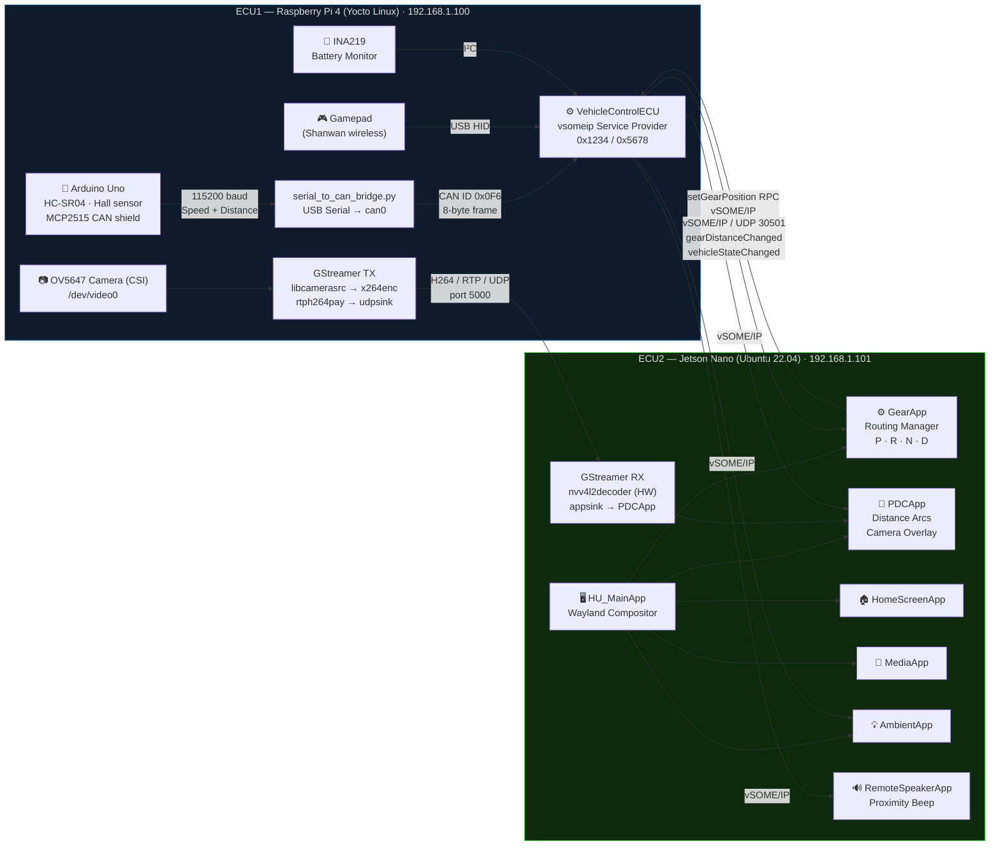
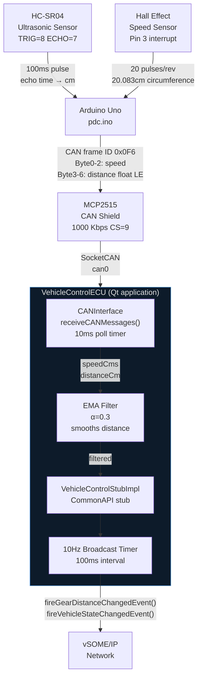
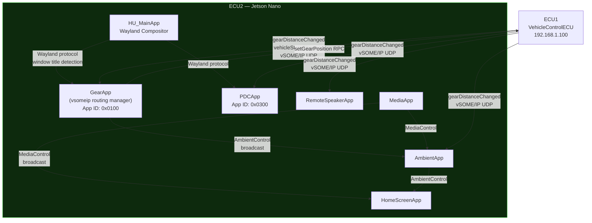
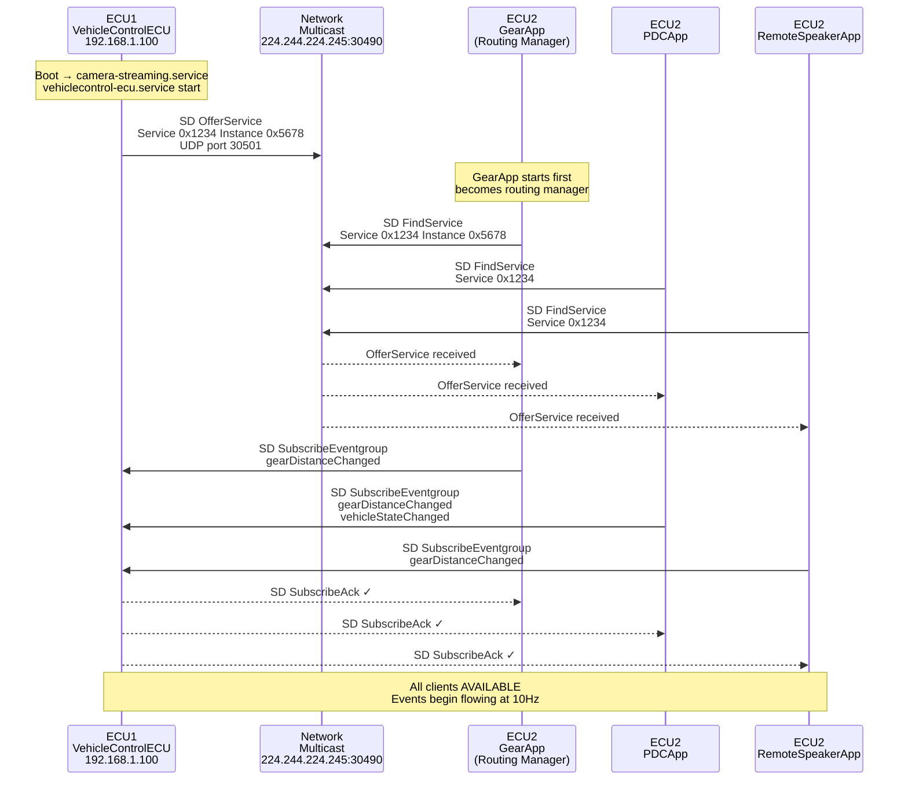
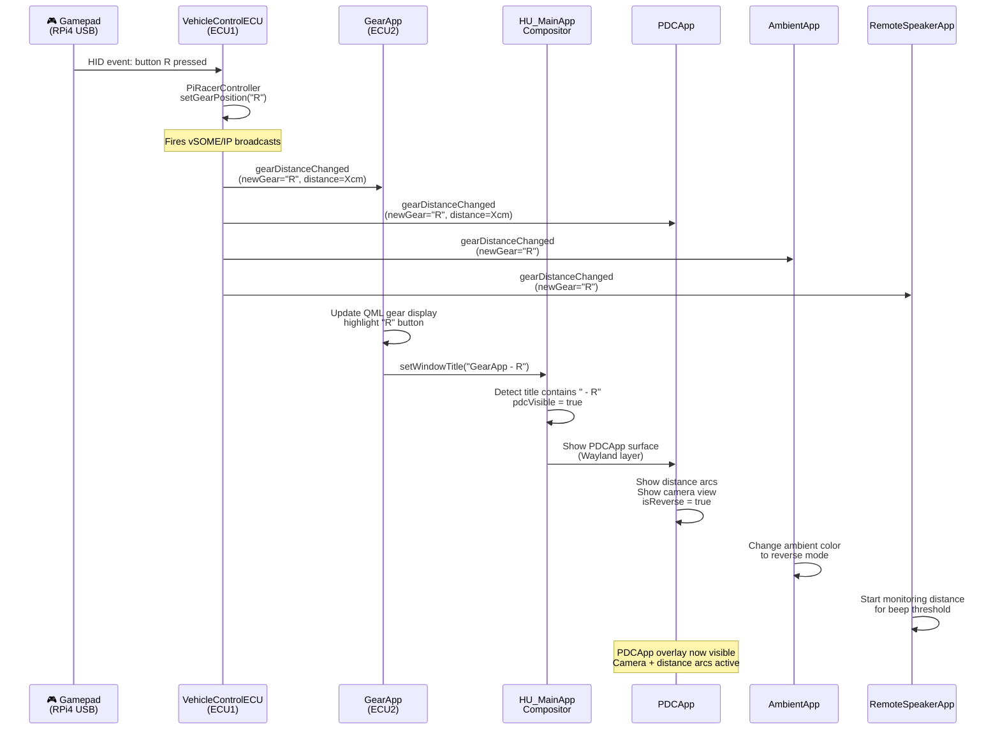
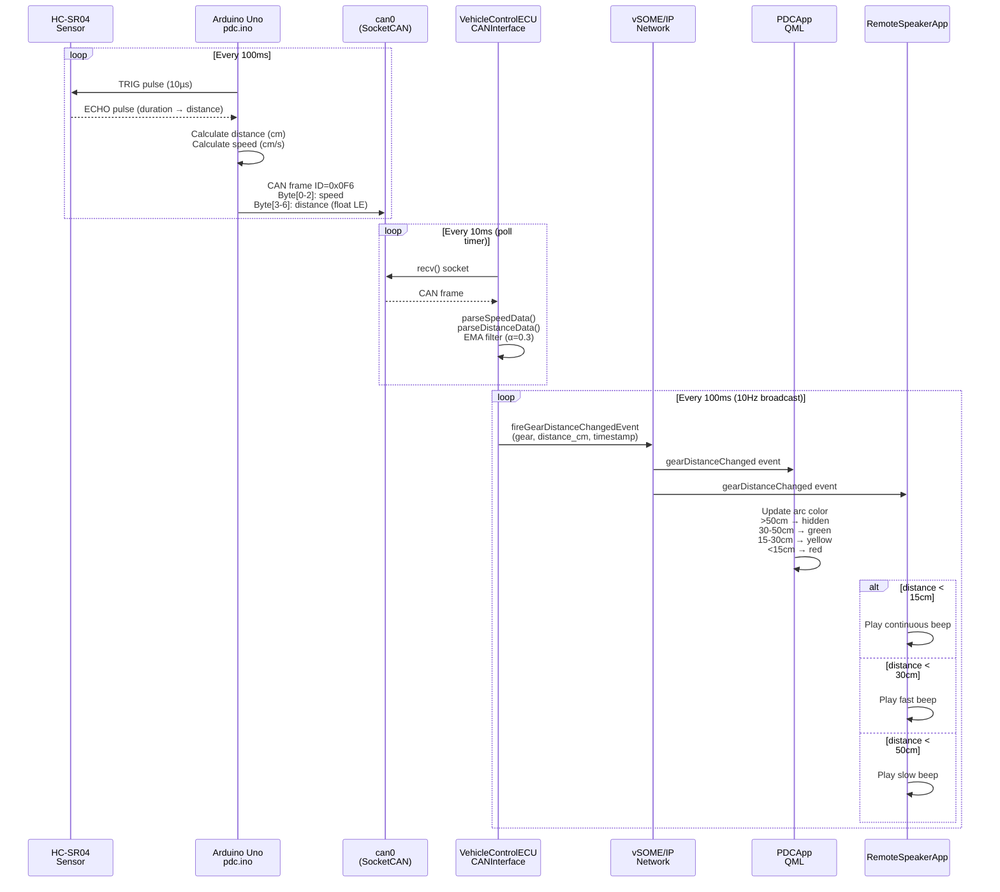
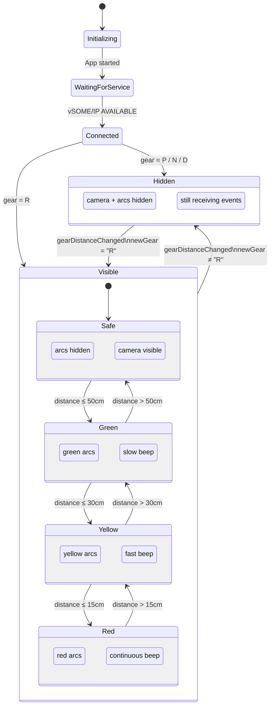
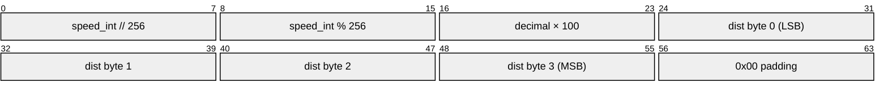
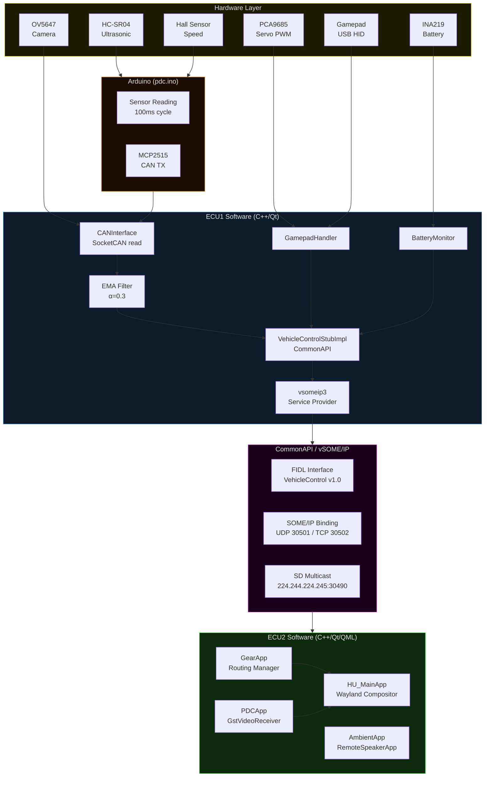

# PDC — Park Distance Control System

A distributed automotive Park Distance Control system built on two embedded ECUs communicating over **vSOME/IP**. The system detects reverse gear, measures rear obstacle distance via ultrasonic sensor, streams live camera footage, and displays a real-time warning overlay on the Head Unit.

---

## 1. System Architecture

> Two ECUs connected over Ethernet. ECU1 (RPi4) owns all physical sensors and publishes data as a vSOME/IP service. ECU2 (Jetson) runs the Head Unit UI apps that consume that service.



---

## 2. ECU1 Internal — Sensor Data Flow

> How raw sensor data flows from hardware into the vSOME/IP broadcast.



---

## 3. ECU2 Internal — App Communication

> How the Jetson apps communicate with each other and with ECU1.



---

## 4. vSOME/IP Service Discovery Sequence

> How ECU1 and ECU2 find each other on the network at startup.



---

## 5. Gear Change Sequence

> Full flow when driver engages Reverse gear via gamepad.



---

## 6. Distance Alert Sequence

> How ultrasonic sensor data travels from Arduino to the display.



---

## 7. Camera Streaming Pipeline

> How video frames travel from the OV5647 lens to the PDCApp display.

```mermaid
flowchart LR
    subgraph RPi4["ECU1 — Raspberry Pi 4"]
        OV["OV5647\nCSI Camera\n/dev/video0"]
        LC["libcamerasrc\nor v4l2src"]
        VC["videoconvert\nYUV → I420"]
        X264["x264enc\nzerolatency\n4000 kbps"]
        H264P["h264parse\nconfig-interval=1"]
        RTP["rtph264pay\npt=96"]
        UDP_TX["udpsink\nhost=192.168.1.101\nport=5000"]

        OV -->|"raw frames\n1280×720 @ 30fps"| LC
        LC --> VC
        VC --> X264
        X264 -->|"H.264 NAL units"| H264P
        H264P --> RTP
        RTP -->|"RTP packets\n~1400 byte MTU"| UDP_TX
    end

    subgraph Jetson["ECU2 — Jetson Nano"]
        UDP_RX["udpsrc\nport=5000"]
        DEPAY["rtph264depay"]
        PARSE["h264parse"]
        DEC["nvv4l2decoder\nTegra HW decode"]
        CONV["nvvidconv\n→ RGBA"]
        SINK["appsink\nGstVideoReceiver.cpp"]
        QML["PDCApp QML\nImage provider\nrear camera view"]

        UDP_RX -->|"RTP packets"| DEPAY
        DEPAY -->|"H.264 bitstream"| PARSE
        PARSE -->|"NAL units"| DEC
        DEC -->|"NvBuffer"| CONV
        CONV -->|"RGBA frames"| SINK
        SINK -->|"QImage / texture"| QML
    end

    UDP_TX -->|"Ethernet\n192.168.1.100 → .101\n~0.3ms latency"| UDP_RX

    style RPi4 fill:#0d1b2a,stroke:#4a90d9,color:#e0e0e0
    style Jetson fill:#0d2a0d,stroke:#4ad94a,color:#e0e0e0
```



---

## 8. PDCApp State Machine

> PDCApp visibility and behavior based on gear state.



---

## 9. CAN Frame Format

> Arduino → RPi4 data encoding for speed and distance.



**CAN ID:** `0x0F6` &nbsp;|&nbsp; **DLC:** 8 bytes &nbsp;|&nbsp; **Rate:** 100ms &nbsp;|&nbsp; **Bus speed:** 1000 Kbps

| Bytes | Field | Encoding |
|---|---|---|
| 0–1 | Speed integer part | `(data[0] << 8) \| data[1]` → cm/s |
| 2 | Speed decimal part | `data[2] / 100.0` → cm/s fraction |
| 3–6 | Distance | `float` little-endian → cm |
| 7 | Padding | `0x00` |

---

## 10. Software Stack



---

## Features

- **Park Distance Control** — real-time ultrasonic distance measurement (0–200 cm) with color-coded arc overlay
- **Reverse camera** — live H.264 video stream from OV5647 displayed in PDCApp when reverse gear is engaged
- **Gear control** — wireless gamepad on RPi4 changes gear; GearApp UI on Jetson reflects it instantly via vSOME/IP
- **Proximity beep** — RemoteSpeakerApp triggers audio alerts as obstacle distance decreases
- **Ambient lighting** — AmbientApp changes lighting color based on gear and vehicle state
- **Speed & battery monitoring** — Hall effect wheel speed sensor + INA219 battery monitor, broadcast at 10 Hz
- **Service-oriented architecture** — all ECU and app communication via CommonAPI/vSOME/IP
- **Wayland compositor** — HU_MainApp multiplexes all Qt/QML apps onto a single display surface

---

## Repository Structure

```
PDC/
├── app/
│   ├── VehicleControlECU/      # ECU1: sensor fusion, CAN, gamepad, vsomeip service provider
│   ├── VehicleControlMock/     # Standalone mock of ECU1 for Jetson-only testing
│   ├── HU_MainApp/             # ECU2: Wayland compositor / Head Unit shell
│   ├── GearApp/                # Gear selector UI + vsomeip routing manager
│   ├── PDCApp/                 # Distance arc overlay + live camera (GStreamer appsink)
│   ├── RemoteSpeakerApp/       # Proximity beep audio controller
│   ├── AmbientApp/             # Ambient lighting control
│   ├── MediaApp/               # Media player
│   ├── HomeScreenApp/          # Home/idle screen
│   ├── IC_MainApp/             # Instrument Cluster compositor (separate display)
│   ├── run_pdc_test.sh         # Build & launch all ECU2 apps
│   └── test_pdc.sh             # Automated integration test suite (T01–T14)
├── Arduino/
│   ├── pdc/pdc.ino             # Arduino sketch: HC-SR04 + Hall sensor + MCP2515 CAN
│   └── serial_to_can_bridge.py # USB serial → virtual CAN bridge (non-Yocto fallback)
├── commonapi/
│   ├── fidl/                   # Service interface definitions (.fidl + .fdepl)
│   │   ├── VehicleControl.fidl
│   │   ├── AmbientControl.fidl
│   │   └── MediaControl.fidl
│   └── generated/              # Auto-generated CommonAPI stubs and proxies
├── deps/                       # vsomeip and CommonAPI built from source
└── install_folder/             # Compiled shared libraries and headers
```


---

## Hardware

### ECU1 — Raspberry Pi 4

| Component | Details |
|---|---|
| OS | Yocto Linux (custom image with `camera-streaming.service` + `vehiclecontrol-ecu.service`) |
| Camera | OV5647 via CSI — GStreamer `libcamerasrc` pipeline |
| CAN | `can0` built into Yocto image |
| Gamepad | Shanwan wireless controller (USB) |
| Servo driver | Adafruit PCA9685 (I²C PWM) |
| Battery monitor | INA219 (I²C) |

### ECU2 — Jetson Nano

| Component | Details |
|---|---|
| OS | Ubuntu 22.04 (JetPack) |
| Display | HDMI via Wayland (HU_MainApp compositor) |
| H.264 decode | `nvv4l2decoder` (Tegra hardware accelerated) |

### Arduino Uno + MCP2515 Shield

| Sensor | Pin | Details |
|---|---|---|
| HC-SR04 ultrasonic | TRIG=8, ECHO=7 | Range 2–200 cm, 100 ms sample interval |
| Hall effect speed | Pin 3 (interrupt) | 20 pulses/rev, wheel circumference 20.083 cm |
| MCP2515 CAN | CS=9 | 1000 Kbps, CAN ID `0x0F6` |

---

## Network

| Link | Interface | Addresses | Purpose |
|---|---|---|---|
| Wired Ethernet | RPi4 `eth0` ↔ Jetson `enP8p1s0` | `192.168.1.100` ↔ `192.168.1.101` | vSOME/IP + camera RTP stream |
| WiFi (optional) | RPi4 `wlan0` ↔ Jetson `wlP1p1s0` | DHCP | SSH / development only |

---

## Getting Started

### Prerequisites — ECU2 (Jetson Nano)

```bash
sudo apt install qt5-default qtwayland5 \
    gstreamer1.0-tools gstreamer1.0-plugins-good \
    gstreamer1.0-plugins-bad gstreamer1.0-plugins-ugly
# CommonAPI + vsomeip built from source (see deps/)
```

### Prerequisites — ECU1 (Raspberry Pi 4)

Flash the Yocto image. Both services start automatically on boot.

```bash
systemctl status camera-streaming.service    # OV5647 → H264/RTP → 192.168.1.101:5000
systemctl status vehiclecontrol-ecu.service  # vsomeip service provider
```

### Build — ECU2

```bash
git clone <repo-url> && cd PDC/app
./run_pdc_test.sh build
```

### Run — ECU2

```bash
export DISPLAY=:1 && xhost +local:
cd ~/PDC/app && ./run_pdc_test.sh run
```

**Usage:** Click **R** in GearApp → PDCApp overlay appears with live camera and distance arcs. Move object in front of sensor to see zone changes. Click **P / N / D** → overlay hides.

---

## vSOME/IP Parameters

| Parameter | Value |
|---|---|
| Service ID | `0x1234` |
| Instance ID | `0x5678` |
| UDP port | `30501` |
| TCP port | `30502` |
| SD multicast group | `224.244.224.245:30490` |
| ECU1 unicast | `192.168.1.100` |
| ECU2 unicast | `192.168.1.101` |
| Routing manager (ECU2) | `GearApp` |

---

## Troubleshooting

**`could not connect to display`**
```bash
export DISPLAY=:1 && xhost +local:
```

**Camera busy on RPi4**
```bash
systemctl restart camera-streaming.service
```

**vsomeip service not discovered**
```bash
sudo ip route add 224.0.0.0/4 dev enP8p1s0
```

**No CAN interface (development machine)**
```bash
sudo modprobe vcan
sudo ip link add dev can0 type vcan && sudo ip link set can0 up
python3 Arduino/serial_to_can_bridge.py
```

**VehicleControlMock routing conflict**
```bash
pkill -f GearApp && sleep 2
./test_pdc.sh --no-build --mock-only
```

---

## License

Developed as part of the **SEAME ** automotive embedded systems program.
